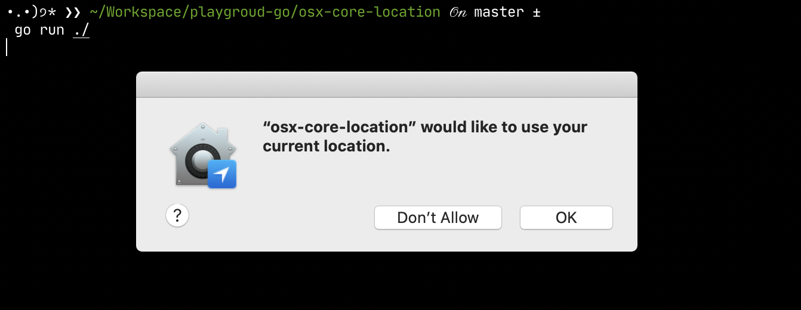

# osx-core-location

Retrieve macOS's current location from Go.

Related:
- [Documentation about cgo](https://golang.org/cmd/cgo), create Go packages that call C code
- [Apple's docs about `CLLocationManager`](https://developer.apple.com/documentation/corelocation/cllocationmanager?language=objc), the object that delivers location-related events